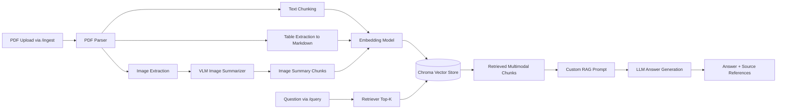
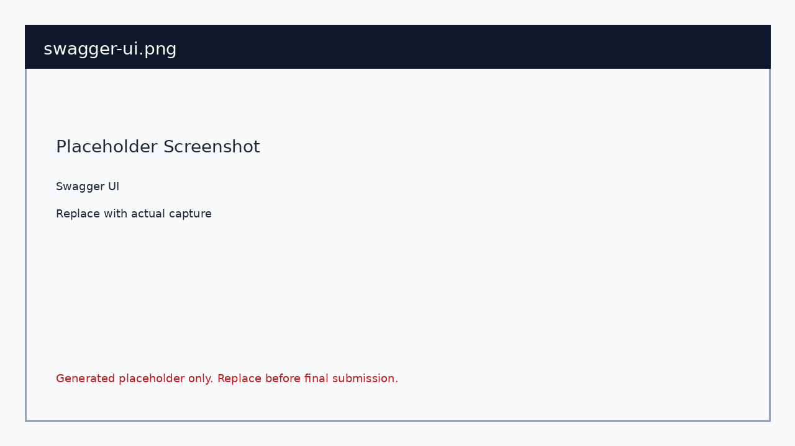
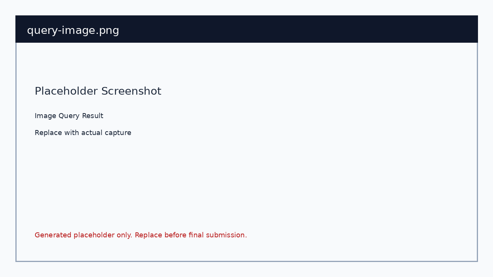
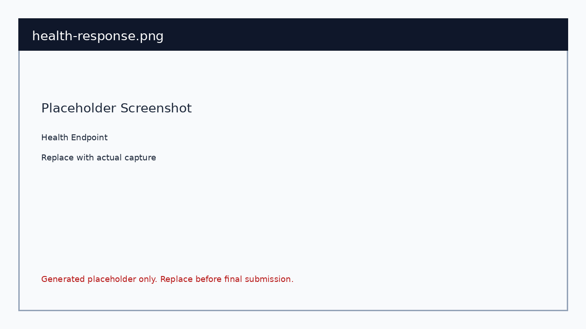

# Multimodal RAG System with FastAPI

## 6. Problem Statement

### 1) Domain Identification
This project is positioned in automotive regulatory compliance and homologation engineering. Typical users include OEM compliance teams, test engineers, certification agencies, and quality/governance stakeholders who work with AIS, CMVR, and Bharat NCAP standards.

### 2) Problem Description
Automotive regulations are commonly distributed as large multimodal PDF files where critical information is fragmented across:
- legal and technical text clauses,
- parameter-heavy tables with limits, exceptions, and notes,
- complex nomenclatures and abbreviations,
- process-flow diagrams and annexure cross-references.

Users struggle to answer practical questions quickly (for example, what limit applies under a given test condition, or which step is next in a certification flow) because traditional keyword search cannot reliably connect related evidence across text, tables, and visual components.

### 3) Why This Problem Is Unique
This is not a generic document Q and A problem. The automotive standards setting introduces domain-specific complexity:
- specialized terminology and coded references,
- strict dependence on numeric thresholds and conditional clauses,
- decision logic expressed in process flows and annexures,
- safety-critical and compliance-critical consequences when interpretation is wrong.

A valid answer often requires combining evidence from multiple modalities and multiple pages, not just matching one paragraph.

### 4) Why RAG Is the Right Approach
Retrieval-Augmented Generation (RAG) is preferable here because regulations change over time and answers must remain grounded in source documents:
- better than manual reading: faster cross-document and cross-modality lookup,
- better than keyword search: semantic retrieval handles terminology variations,
- better than fine-tuning-only approaches: updated PDFs can be re-ingested without retraining,
- better for audits: answers include citations (filename, page, chunk type) for traceability.

The system therefore balances flexibility, maintainability, and evidence-backed responses for high-stakes compliance workflows.

### 5) Expected Outcomes
A successful system should enable users to ask natural-language questions and receive grounded answers supported by source references from text, table, and image-summary chunks.

It should support queries such as:
- What are the adult occupant protection criteria and scoring sections?
- Which table defines thresholds for a specific test condition?
- What does a given process-flow diagram indicate about test/certification sequence?
- Which annexure and clause apply to a specific vehicle category or exception?

It should support decisions such as test planning, compliance gap assessment, homologation readiness checks, and regulator/audit reporting with transparent evidence.

## 7. Architecture Overview

### Ingestion and Query Pipeline



### Runtime Components

- Parser: PyMuPDF + pdfplumber for text/tables/images.
- VLM: BLIP image captioning model to summarize extracted figures.
- Embeddings: Sentence-transformers model for all chunk types.
- Vector store: Chroma persistent collection.
- LLM: OpenAI chat model when API key exists, local fallback model otherwise.
- API: FastAPI with typed request/response schemas.

## 8. Technology Choices

- Document parser: PyMuPDF + pdfplumber.
Reason: PyMuPDF is fast and robust for page-level text and image extraction, while pdfplumber provides practical table extraction APIs. This combination is lightweight and reproducible in local environments.

- Embedding model: `sentence-transformers/all-MiniLM-L6-v2`.
Reason: It is performant for semantic search on CPU, widely used for RAG baselines, and provides good retrieval quality for structured and unstructured text.

- Vector store: ChromaDB.
Reason: Chroma offers persistent local storage, easy metadata filtering/access, and simple integration with LangChain, making it ideal for assignment-scale reproducibility.

- LLM: OpenAI `gpt-4o-mini` with local fallback `google/flan-t5-base`.
Reason: OpenAI provides strong answer quality; the local fallback allows running without external API credentials.

- Vision model: `Salesforce/blip-image-captioning-base`.
Reason: BLIP provides direct image-to-text generation for summarizing extracted PDF figures without requiring paid APIs.

- Framework: FastAPI + LangChain integrations.
Reason: FastAPI satisfies endpoint and Swagger requirements, while LangChain components reduce boilerplate around embedding/vector/LLM orchestration.

## 9. Setup Instructions

### 1. Clone Repository

```bash
git clone <your-public-repo-url>
cd Multimodal-RAG-System-with-FastAPI
```

### 2. Create Environment

```bash
python -m venv .venv
source .venv/bin/activate
pip install --upgrade pip
pip install -r requirements.txt
```

Install OCR runtime for scanned PDFs:

```bash
sudo apt-get update
sudo apt-get install -y tesseract-ocr
```

### 3. Configure Environment Variables

```bash
cp .env.example .env
```

Optional: add `OPENAI_API_KEY` in `.env` for stronger answer generation.
OCR fallback is enabled by default and can be controlled with `ENABLE_OCR_FALLBACK` and `OCR_DPI`.

### 4. Run FastAPI Server

```bash
uvicorn main:app --reload --host 0.0.0.0 --port 8000
```

### 5. Open API Docs

- Swagger UI: `http://localhost:8000/docs`
- Health check: `http://localhost:8000/health`

## 10. API Documentation

### GET /health
Returns uptime, model readiness, indexed document count, and index size.

Sample response:

```json
{
    "status": "ok",
    "uptime_seconds": 125.31,
    "model_readiness": {
        "embeddings_ready": true,
        "vector_store_ready": true,
        "vlm_ready": true,
        "llm_ready": true
    },
    "indexed_documents": 1,
    "index_size": 142
}
```

### POST /ingest
Accepts a PDF upload, parses text/tables/images, summarizes images via VLM, embeds all chunk types, and indexes them.

Sample curl:

```bash
curl -X POST "http://localhost:8000/ingest" \
    -F "file=@sample_documents/AIS_197-1_BNCAP.pdf"
```

Sample response:

```json
{
    "filename": "AIS_197-1_BNCAP.pdf",
    "text_chunks": 110,
    "table_chunks": 17,
    "image_summary_chunks": 9,
    "total_chunks": 136,
    "processing_time_seconds": 18.742
}
```

### POST /query
Accepts a natural language question, retrieves top-K multimodal chunks, and returns grounded answer with source references.

Sample request:

```json
{
    "question": "What battery safety limits are defined in the document?"
}
```

Sample response:

```json
{
    "answer": "The retrieved sections define battery-related safety constraints including ...",
    "sources": [
        {
            "filename": "AIS_197-1_BNCAP.pdf",
            "page": 38,
            "chunk_type": "table",
            "chunk_index": 1
        },
        {
            "filename": "AIS_197-1_BNCAP.pdf",
            "page": 41,
            "chunk_type": "text",
            "chunk_index": 2
        }
    ]
}
```

The repository currently includes [sample_documents/AIS_197-1_BNCAP.pdf](/workspaces/Multimodal-RAG-System-with-FastAPI/sample_documents/AIS_197-1_BNCAP.pdf) as the sample document. Replace the file path in the curl command if you add a different PDF.

### GET /docs
FastAPI auto-generated OpenAPI/Swagger UI.

### Additional Endpoint

- GET `/documents`: lists indexed source files and index counts.

## 11. Screenshots

Place screenshots in the `screenshots/` folder and embed them here.

Required evidence:

1. Swagger UI


2. Successful Ingestion


3. Text Query Result


4. Table Query Result


5. Image Query Result


6. Health Endpoint


## 12. Limitations & Future Work

- Table extraction quality depends on source PDF structure; OCR fallback uses heuristics and may not perfectly reconstruct complex scanned tables.
- BLIP image captions are generic for some technical diagrams; domain-tuned VLMs can improve precision.
- The default local fallback LLM is lightweight and may produce less fluent answers than hosted frontier models.
- Retrieval currently uses plain similarity search; adding hybrid retrieval (BM25 + vectors) could improve recall.
- No document deletion/versioning endpoint yet; production systems should support lifecycle and re-index workflows.
- No automated tests included in this baseline; adding unit and API integration tests is the next priority.

## Repository Layout

```text
.
├── README.md
├── requirements.txt
├── .env.example
├── main.py
├── src/
│   ├── ingestion/
│   ├── retrieval/
│   ├── models/
│   └── api/
├── sample_documents/
├── screenshots/
└── .gitignore
```