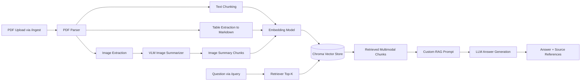

# Multimodal RAG System with FastAPI

## 6. Problem Statement
Modern engineering and compliance teams work with PDF-heavy documentation where critical information is spread across paragraphs, structured tables, and visual artifacts such as charts and diagrams. In the automotive domain, AIS-175 is a strong example of this challenge. A single regulatory document can include legal language, threshold values in tabular form, and visual flow-like diagrams that are difficult to query quickly. Traditional keyword search across raw PDFs is often inadequate because it cannot reliably preserve context, cannot reason over related chunks, and cannot account for multimodal evidence in a grounded answer.

This project addresses that gap by implementing a multimodal Retrieval-Augmented Generation (RAG) system exposed through FastAPI. The system ingests a PDF, separates content by modality (text, table, image), converts each modality into retrievable semantic chunks, and answers user questions using only retrieved evidence. The target outcome is a practical API that supports compliance workflows such as: extracting limits from tabular sections, clarifying definitions from paragraphs, and describing the meaning of visual content in diagrams.

The core issue in multimodal PDF question answering is not only retrieval quality but representation fidelity. Text can usually be chunked and embedded directly. Tables, however, lose meaning when flattened naively, so this system preserves tabular structure in Markdown-like form before embedding. Images introduce a larger issue: a vector database cannot directly embed binary image files in a way that supports natural-language retrieval with textual questions. To solve this, each extracted image is passed through a Vision Language Model (VLM) to generate a textual summary containing the salient visible entities, labels, and relationships. These image summaries are then embedded like other chunks, allowing image-derived evidence to participate in standard semantic retrieval.

Grounding is a first-class design objective. The query endpoint returns both an answer and explicit source references containing filename, page number, and chunk type. This helps evaluators and end users verify whether a response came from text, tables, or image summaries, and supports auditing for high-stakes domains where hallucinations are unacceptable. The prompt used by the generation step is custom-written to enforce grounded behavior, instructing the model to use only retrieved context and to admit when information is missing.

The assignment also requires reproducibility and maintainability. This repository is structured into modular source packages for ingestion, retrieval, model wrappers, and API routing. Dependencies are pinned, environment variables are documented in `.env.example`, and endpoints are exposed with OpenAPI/Swagger through FastAPI. The architecture supports extension in several ways: alternative vector stores, stronger embedding models, production-grade OCR/table extraction pipelines, and domain-specific prompting.

In summary, this project solves a realistic enterprise problem: turning static multimodal PDF knowledge into an operational question-answering API with verifiable citations. It is designed to be transparent, reproducible, and rubric-aligned, while remaining flexible enough for future improvements in retrieval precision, model quality, and scale.

## 7. Architecture Overview

### Ingestion and Query Pipeline



### Runtime Components

- Parser: PyMuPDF + pdfplumber for text/tables/images.
- VLM: BLIP image captioning model to summarize extracted figures.
- Embeddings: Sentence-transformers model for all chunk types.
- Vector store: Chroma persistent collection.
- LLM: OpenAI chat model when API key exists, local fallback model otherwise.
- API: FastAPI with typed request/response schemas.

## 8. Technology Choices

- Document parser: PyMuPDF + pdfplumber.
Reason: PyMuPDF is fast and robust for page-level text and image extraction, while pdfplumber provides practical table extraction APIs. This combination is lightweight and reproducible in local environments.

- Embedding model: `sentence-transformers/all-MiniLM-L6-v2`.
Reason: It is performant for semantic search on CPU, widely used for RAG baselines, and provides good retrieval quality for structured and unstructured text.

- Vector store: ChromaDB.
Reason: Chroma offers persistent local storage, easy metadata filtering/access, and simple integration with LangChain, making it ideal for assignment-scale reproducibility.

- LLM: OpenAI `gpt-4o-mini` with local fallback `google/flan-t5-base`.
Reason: OpenAI provides strong answer quality; the local fallback allows running without external API credentials.

- Vision model: `Salesforce/blip-image-captioning-base`.
Reason: BLIP provides direct image-to-text generation for summarizing extracted PDF figures without requiring paid APIs.

- Framework: FastAPI + LangChain integrations.
Reason: FastAPI satisfies endpoint and Swagger requirements, while LangChain components reduce boilerplate around embedding/vector/LLM orchestration.

## 9. Setup Instructions

### 1. Clone Repository

```bash
git clone <your-public-repo-url>
cd Multimodal-RAG-System-with-FastAPI
```

### 2. Create Environment

```bash
python -m venv .venv
source .venv/bin/activate
pip install --upgrade pip
pip install -r requirements.txt
```

Install OCR runtime for scanned PDFs:

```bash
sudo apt-get update
sudo apt-get install -y tesseract-ocr
```

### 3. Configure Environment Variables

```bash
cp .env.example .env
```

Optional: add `OPENAI_API_KEY` in `.env` for stronger answer generation.
OCR fallback is enabled by default and can be controlled with `ENABLE_OCR_FALLBACK` and `OCR_DPI`.

### 4. Run FastAPI Server

```bash
uvicorn main:app --reload --host 0.0.0.0 --port 8000
```

### 5. Open API Docs

- Swagger UI: `http://localhost:8000/docs`
- Health check: `http://localhost:8000/health`

## 10. API Documentation

### GET /health
Returns uptime, model readiness, indexed document count, and index size.

Sample response:

```json
{
    "status": "ok",
    "uptime_seconds": 125.31,
    "model_readiness": {
        "embeddings_ready": true,
        "vector_store_ready": true,
        "vlm_ready": true,
        "llm_ready": true
    },
    "indexed_documents": 1,
    "index_size": 142
}
```

### POST /ingest
Accepts a PDF upload, parses text/tables/images, summarizes images via VLM, embeds all chunk types, and indexes them.

Sample curl:

```bash
curl -X POST "http://localhost:8000/ingest" \
    -F "file=@sample_documents/AIS 175_Final Draft_MARCH_2025.pdf"
```

Sample response:

```json
{
    "filename": "AIS 175_Final Draft_MARCH_2025.pdf",
    "text_chunks": 110,
    "table_chunks": 17,
    "image_summary_chunks": 9,
    "total_chunks": 136,
    "processing_time_seconds": 18.742
}
```

### POST /query
Accepts a natural language question, retrieves top-K multimodal chunks, and returns grounded answer with source references.

Sample request:

```json
{
    "question": "What battery safety limits are defined in the document?"
}
```

Sample response:

```json
{
    "answer": "The retrieved sections define battery-related safety constraints including ...",
    "sources": [
        {
            "filename": "AIS 175_Final Draft_MARCH_2025.pdf",
            "page": 38,
            "chunk_type": "table",
            "chunk_index": 1
        },
        {
            "filename": "AIS 175_Final Draft_MARCH_2025.pdf",
            "page": 41,
            "chunk_type": "text",
            "chunk_index": 2
        }
    ]
}
```

### GET /docs
FastAPI auto-generated OpenAPI/Swagger UI.

### Additional Endpoint

- GET `/documents`: lists indexed source files and index counts.

## 11. Screenshots

Place screenshots in the `screenshots/` folder and embed them here.

Required evidence:

1. Swagger UI


2. Successful Ingestion


3. Text Query Result


4. Table Query Result


5. Image Query Result


6. Health Endpoint


## 12. Limitations & Future Work

- Table extraction quality depends on source PDF structure; OCR fallback uses heuristics and may not perfectly reconstruct complex scanned tables.
- BLIP image captions are generic for some technical diagrams; domain-tuned VLMs can improve precision.
- The default local fallback LLM is lightweight and may produce less fluent answers than hosted frontier models.
- Retrieval currently uses plain similarity search; adding hybrid retrieval (BM25 + vectors) could improve recall.
- No document deletion/versioning endpoint yet; production systems should support lifecycle and re-index workflows.
- No automated tests included in this baseline; adding unit and API integration tests is the next priority.

## Repository Layout

```text
.
├── README.md
├── requirements.txt
├── .env.example
├── main.py
├── src/
│   ├── ingestion/
│   ├── retrieval/
│   ├── models/
│   └── api/
├── sample_documents/
├── screenshots/
└── .gitignore
```